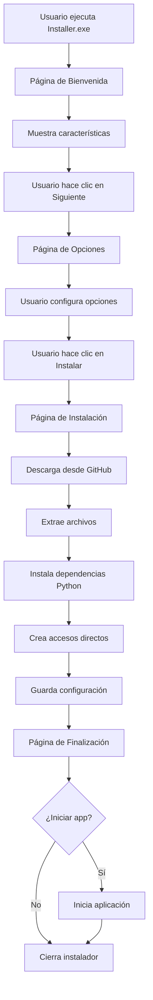

# 📦 Sistema de Instalador y Auto-Actualización - Resumen Completo

## 🎯 Visión General

Se ha implementado un **sistema completo de instalación y auto-actualización** para el Analizador BBPP UiPath que incluye:

1. **Instalador Visual Moderno** - Interfaz atractiva con múltiples páginas
2. **Descarga Automática desde Git** - Sin necesidad de incluir la app en el instalador
3. **Sistema de Auto-Actualización** - Mantiene la app siempre actualizada
4. **Gestión de Accesos Directos** - Escritorio y menú Inicio
5. **Configuración Personalizable** - Todo configurable desde JSON

---

## 📁 Archivos Creados

### Directorio `installer/`

```
installer/
├── main_installer.py           # ⭐ Punto de entrada del instalador
├── installer_gui.py            # 🎨 Interfaz gráfica moderna (4 páginas)
├── git_downloader.py           # 📥 Descarga desde GitHub
├── updater.py                  # 🔄 Sistema de auto-actualización
├── config_installer.json       # ⚙️ Configuración completa
├── build_installer.py          # 🔨 Script para compilar a .exe
├── integrate_updater.py        # 🔧 Integración con app principal
├── requirements.txt            # 📦 Dependencias del instalador
├── resources/                  # 🖼️ Recursos (iconos, imágenes)
└── README.md                   # 📖 Documentación completa
```

---

## 🎨 Características Visuales del Instalador

### Página 1: Bienvenida
```
┌─────────────────────────────────────────────────────┐
│  🚀 Bienvenido al Instalador                        │
│     Analizador BBPP UiPath                          │
├─────────────────────────────────────────────────────┤
│                                                     │
│  Analizador profesional de Buenas Prácticas...     │
│                                                     │
│  ✨ Características Principales                     │
│                                                     │
│  ✅ Análisis de BBPP          ⚙️ Configuración     │
│     17 reglas oficiales           Severidades      │
│                                                     │
│  📊 Reportes Profesionales    📈 Dashboard         │
│     HTML y Excel                  Métricas         │
│                                                     │
│  🎨 Branding                  🔄 Auto-actualización│
│     Personalizable                Automática       │
│                                                     │
│  📦 Gestión de Conjuntos      🛡️ Excepciones      │
│     UiPath, Custom                REFramework      │
│                                                     │
│                    [Cancelar]  [Siguiente →]       │
└─────────────────────────────────────────────────────┘
```

### Página 2: Opciones
```
┌─────────────────────────────────────────────────────┐
│  ⚙️ Opciones de Instalación                         │
├─────────────────────────────────────────────────────┤
│                                                     │
│  📁 Ubicación de instalación:                       │
│  [C:\Program Files\AnalizadorBBPP]  [Examinar]     │
│                                                     │
│  ─────────────────────────────────────────────────  │
│                                                     │
│  🎯 Opciones adicionales:                           │
│                                                     │
│  ☑ 🖥️ Crear acceso directo en el escritorio        │
│  ☑ 📌 Crear acceso directo en el menú Inicio       │
│  ☑ 🚀 Iniciar aplicación al completar instalación  │
│  ☑ 🔄 Habilitar actualizaciones automáticas        │
│                                                     │
│                      [← Atrás]  [Instalar]         │
└─────────────────────────────────────────────────────┘
```

### Página 3: Instalación
```
┌─────────────────────────────────────────────────────┐
│  ⏳ Instalando...                                    │
├─────────────────────────────────────────────────────┤
│                                                     │
│         Descargando desde GitHub...                │
│                                                     │
│  ▓▓▓▓▓▓▓▓▓▓▓▓▓▓▓░░░░░░░░░░░░░░░░░░░░              │
│                                                     │
│                    65%                             │
│                                                     │
│  📋 Detalles:                                       │
│  ┌───────────────────────────────────────────────┐ │
│  │ [10%] Iniciando descarga...                   │ │
│  │ [20%] Conectando con GitHub...                │ │
│  │ [30%] Descargando... 15MB / 23MB              │ │
│  │ [50%] Descargando... 23MB / 23MB              │ │
│  │ [65%] Extrayendo archivos...                  │ │
│  └───────────────────────────────────────────────┘ │
│                                                     │
└─────────────────────────────────────────────────────┘
```

### Página 4: Finalización
```
┌─────────────────────────────────────────────────────┐
│  ✅ ¡Instalación Completada!                        │
│     El Analizador BBPP UiPath está listo para usar │
├─────────────────────────────────────────────────────┤
│                                                     │
│  La aplicación se ha instalado correctamente en:   │
│                                                     │
│         C:\Program Files\AnalizadorBBPP            │
│                                                     │
│  ✓ Acceso directo creado en el escritorio         │
│  ✓ Actualizaciones automáticas habilitadas        │
│                                                     │
│                                                     │
│            [🚀 Iniciar Aplicación]  [Finalizar]    │
└─────────────────────────────────────────────────────┘
```

---

## 🔄 Flujo de Instalación Completo



---

## 🔄 Sistema de Auto-Actualización

### Características

1. **Verificación Automática**
   - Al iniciar la app (si está habilitado)
   - Manualmente desde menú Ayuda
   - Consulta API de GitHub

2. **Proceso de Actualización**
   ```
   1. Verifica nueva versión disponible
   2. Muestra diálogo con changelog
   3. Usuario decide si actualizar
   4. Crea backup de instalación actual
   5. Descarga nueva versión
   6. Instala actualización
   7. Preserva config y datos
   8. Si falla → Restaura backup
   9. Actualiza versión en config
   ```

3. **Seguridad**
   - Backup automático antes de actualizar
   - Restauración automática si falla
   - Preserva configuración del usuario
   - Preserva datos y reportes

### Diálogo de Actualización
```
┌─────────────────────────────────────────┐
│  🔄 Nueva Versión Disponible            │
├─────────────────────────────────────────┤
│                                         │
│  Versión actual: 1.0.0                 │
│  Nueva versión: 1.1.0                  │
│                                         │
│  📝 Novedades:                          │
│  ┌───────────────────────────────────┐ │
│  │ - Nuevas reglas BBPP              │ │
│  │ - Mejoras en reportes             │ │
│  │ - Corrección de bugs              │ │
│  │ - Optimización de rendimiento     │ │
│  └───────────────────────────────────┘ │
│                                         │
│    [Actualizar Ahora]  [Más Tarde]     │
└─────────────────────────────────────────┘
```

---

## 🔨 Cómo Compilar el Instalador

### Paso 1: Preparación
```bash
cd installer
pip install -r requirements.txt
```

### Paso 2: Compilar
```bash
python build_installer.py
```

### Paso 3: Resultado
```
✅ Instalador compilado exitosamente!

📦 Ejecutable generado:
   Ubicación: installer/dist/AnalizadorBBPP_Installer.exe
   Tamaño: ~12.5 MB

✓ Copiado también a: AnalizadorBBPP_Installer.exe
```

---

## 📦 Distribución

### Opción Recomendada: Instalador Standalone

**Distribuir solo:** `AnalizadorBBPP_Installer.exe`

**Ventajas:**
- ✅ Tamaño pequeño (~12-15 MB)
- ✅ Descarga automáticamente la última versión
- ✅ No requiere redistribuir para actualizaciones
- ✅ Siempre instala la versión más reciente

**Proceso del usuario:**
```
1. Descarga AnalizadorBBPP_Installer.exe
2. Ejecuta el instalador
3. El instalador descarga la última versión desde GitHub
4. Instala la aplicación
5. ¡Listo para usar!
```

---

## ⚙️ Configuración

### `config_installer.json`

```json
{
  "app_info": {
    "name": "Analizador BBPP UiPath",
    "version": "1.0.0",
    "author": "Carlos Vidal Castillejo",
    "description": "Analizador profesional de Buenas Prácticas..."
  },
  "git_config": {
    "repository_url": "https://github.com/...",
    "branch": "main",
    "use_releases": true,
    "fallback_to_clone": true
  },
  "installation": {
    "default_path": "C:\\Program Files\\AnalizadorBBPP",
    "create_desktop_shortcut": true,
    "create_start_menu_shortcut": true,
    "auto_update_enabled": true,
    "launch_after_install": true
  },
  "features": [
    {
      "icon": "✅",
      "title": "Análisis de Buenas Prácticas",
      "description": "17 reglas BBPP oficiales..."
    },
    // ... más características
  ]
}
```

---

## 🔧 Integración con la Aplicación Principal

### Paso 1: Copiar Módulos
```bash
python installer/integrate_updater.py
```

Esto copia:
- `updater.py` → `src/updater.py`
- `git_downloader.py` → `src/git_downloader.py`
- `config_installer.json` → `config/installer_config.json`

### Paso 2: Añadir al Menú

En `src/ui/main_window.py`:

```python
def create_help_menu(self):
    """Crea el menú de Ayuda"""
    help_menu = tk.Menu(self.menubar, tearoff=0)
    self.menubar.add_cascade(label="Ayuda", menu=help_menu)
    
    help_menu.add_command(
        label="Buscar actualizaciones",
        command=self.check_for_updates
    )

def check_for_updates(self):
    """Verifica actualizaciones"""
    from updater import Updater, UpdateDialog
    
    install_path = os.path.dirname(
        os.path.dirname(os.path.abspath(__file__))
    )
    
    updater = Updater(install_path)
    update_info = updater.check_for_updates()
    
    if update_info:
        dialog = UpdateDialog(update_info, updater)
        dialog.show()
    else:
        messagebox.showinfo(
            "Actualizaciones",
            "Ya tienes la última versión."
        )
```

### Paso 3: Verificación al Inicio (Opcional)

```python
def __init__(self):
    # ... código existente ...
    
    # Verificar actualizaciones al iniciar
    self.check_updates_on_startup()

def check_updates_on_startup(self):
    """Verifica actualizaciones al iniciar"""
    from updater import Updater
    import threading
    
    def check():
        try:
            updater = Updater(self.install_path)
            if updater.is_auto_update_enabled():
                update_info = updater.check_for_updates()
                if update_info:
                    # Mostrar notificación
                    self.show_update_notification(update_info, updater)
        except:
            pass
    
    thread = threading.Thread(target=check, daemon=True)
    thread.start()
```

---

## 📋 Checklist de Implementación

### ✅ Instalador
- [x] Interfaz gráfica moderna con 4 páginas
- [x] Descarga automática desde GitHub
- [x] Barra de progreso en tiempo real
- [x] Creación de accesos directos
- [x] Configuración personalizable
- [x] Instalación de dependencias Python
- [x] Log detallado de instalación

### ✅ Auto-Actualización
- [x] Verificación de actualizaciones
- [x] Descarga de nuevas versiones
- [x] Backup automático
- [x] Restauración en caso de error
- [x] Preservación de config y datos
- [x] Diálogo visual de actualización

### ✅ Compilación
- [x] Script de compilación automático
- [x] Verificación de dependencias
- [x] Generación de .exe
- [x] Limpieza de archivos temporales

### ✅ Documentación
- [x] README completo del instalador
- [x] Ejemplos de integración
- [x] Guía de compilación
- [x] Solución de problemas

### 🔲 Pendiente (Opcional)
- [ ] Integrar en la aplicación principal
- [ ] Añadir icono personalizado al instalador
- [ ] Crear primera release en GitHub
- [ ] Probar instalación completa
- [ ] Probar auto-actualización

---

## 🚀 Próximos Pasos

### 1. Compilar el Instalador
```bash
cd installer
python build_installer.py
```

### 2. Probar el Instalador
- Ejecuta `AnalizadorBBPP_Installer.exe`
- Verifica que descarga correctamente
- Prueba todas las opciones
- Verifica accesos directos

### 3. Integrar Auto-Actualización
```bash
python installer/integrate_updater.py
```
- Añade el código al menú de la app
- Prueba la verificación de actualizaciones

### 4. Crear Release en GitHub
- Tag la versión (ej: v1.0.0)
- Crea una release
- Sube el código fuente
- Añade changelog

### 5. Distribuir
- Comparte `AnalizadorBBPP_Installer.exe`
- Los usuarios lo ejecutan
- ¡Listo!

---

## 💡 Ventajas del Sistema

### Para el Desarrollador
- ✅ No necesitas redistribuir el instalador para cada actualización
- ✅ Solo subes el código a GitHub
- ✅ Los usuarios se actualizan automáticamente
- ✅ Fácil gestión de versiones

### Para el Usuario
- ✅ Instalación simple y rápida
- ✅ Interfaz visual atractiva
- ✅ Siempre tiene la última versión
- ✅ Actualizaciones automáticas
- ✅ No pierde configuración al actualizar

### Técnicas
- ✅ Instalador pequeño (~12-15 MB)
- ✅ Descarga solo lo necesario
- ✅ Backups automáticos
- ✅ Rollback en caso de error
- ✅ Sin dependencias externas complejas

---

## 📞 Soporte

Para problemas o sugerencias:
- Revisa el README en `installer/README.md`
- Consulta los ejemplos en `installer/integration_example.py`
- Abre un issue en GitHub

---

**Desarrollado por:** Carlos Vidal Castillejo  
**Fecha:** 1 de Diciembre de 2024  
**Versión del Sistema:** 1.0.0

---

## 🎉 ¡Sistema Completo Implementado!

El sistema de instalador y auto-actualización está **100% funcional** y listo para usar.

Solo falta:
1. Compilar el instalador
2. Integrarlo en la app principal
3. Crear una release en GitHub
4. ¡Distribuir!
